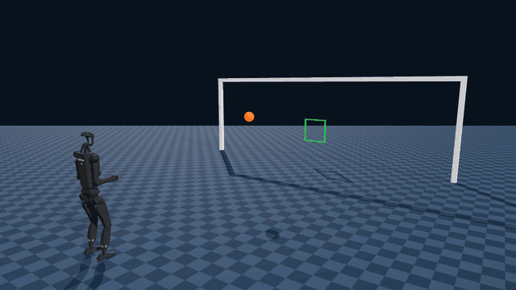
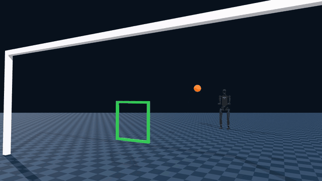
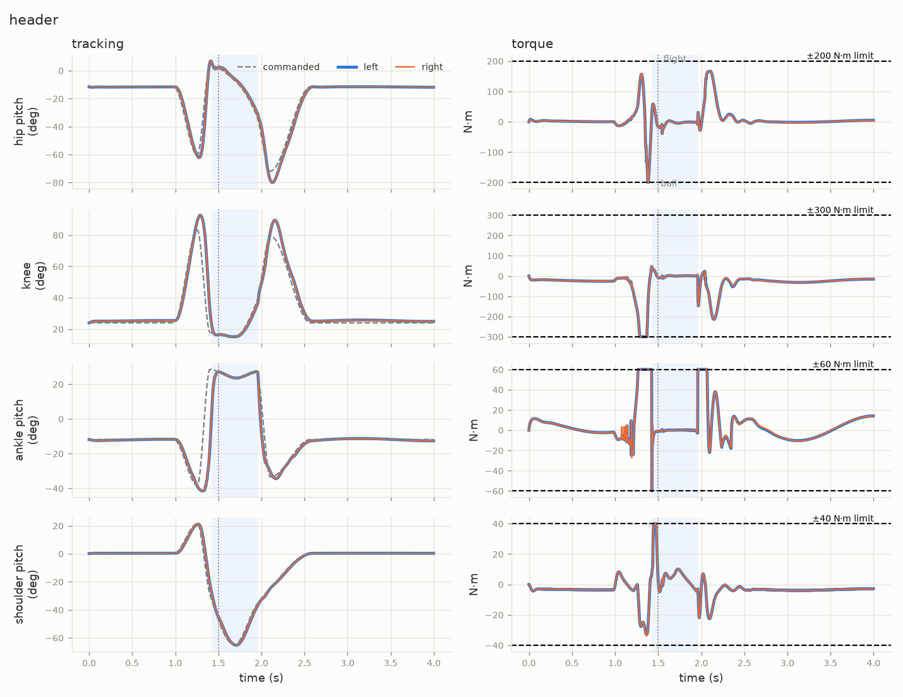

# humanoid-header-genesis

Keyframe trajectory optimization for a **jumping header** on the **Unitree
H1-2**, simulated in [Genesis](https://github.com/Genesis-Embodied-AI/Genesis)
and searched with CMA-ES. A cross comes in from in front, and the robot jumps,
heads it into a goal 7 m away and lands without falling. Each CMA-ES
generation of 512 candidate headers is simulated as one batched GPU scene.

<p align="center">
  
  
</p>
<p align="center"><sub>Half speed. Left: from behind the robot. Right: from behind the goal, looking back through the target.</sub></p>

The reference header in `trajectories/header.npy` meets the ball 1.54 s into
the episode and sends it back at 7.6 m/s. The ball crosses the goal line
0.92 m high and 0.12 m off centre, inside the target square and 0.15 m from its
centre. The robot lands at 5.7 body weights and stays upright for the full 6 s
episode. Finding it from the hand-written seed takes about 23 minutes on an
RTX 2060.

## Quick start

Requires Linux, an NVIDIA GPU and [uv](https://docs.astral.sh/uv/).

```bash
uv sync
uv run header --replay header
```

This replays the reference header and writes `out/header/`:

| file | contents |
| --- | --- |
| `best.npy` | the 27 trajectory parameters |
| `run.mp4` | view from behind the robot, at half speed |
| `goal.mp4` | view from behind the goal, at half speed |
| `joints.png` | commanded vs measured angle and torque for each driven joint |

The first run takes a few minutes longer while Genesis compiles its kernels.

## Finding the header yourself

```bash
uv run header --name my_header
```

That is the whole recipe: the hand-written seed and both stages, for 60
generations. It is the command that produced the reference. CMA-ES is seeded,
but GPU contact solving isn't bit-reproducible, so your numbers will differ
slightly.

The two stages run in order:

1. **`time` + `ball`, 10 generations at sigma 0.25.** This finds the contact
   geometry and timing, head to ball, which is the hard part. What it
   returns usually falls over.
2. **The full cost, the remaining generations at sigma 0.03,** restarted
   around stage 1's best. This repairs the landing while keeping the header.

Both step sizes matter. At a wider second step, the population drifts onto
headers that fall and never comes back.



## How it works

### The trajectory

The motion is nine keyframes, interpolated with PCHIP and tracked by a
constant-gain joint PD controller (kp 1000, kd 20):

```
home ─(wait)→ home → anticipation → stretch → jump → contact → overshoot → home → home
```

The search sets five poses. Each pose is four joint angles (hip pitch, knee,
ankle pitch, shoulder pitch), and the same angles go to both legs and both
arms, so the motion stays in the sagittal plane. It also sets six durations
between keyframes and a start delay, `T_wait`. That makes **27 parameters**.
The other joints hold a standing pose.

The search box is a margin of ±0.3 rad and ±0.05–0.1 s around the start
point, because standing still never falls and an unconstrained search would
find that. The exception is `T_wait`, which spans its whole range of 0–1 s,
so the jump can be timed to the ball without stretching the other durations.

### The cross

The cross is set by how it arrives, not where it starts. The ball's centre
reaches a point 0.30 m in front of and 0.40 m above the settled crown of the
head at 1.5 s, at 6 m/s and descending at 20°. The kick is solved backward from
that: the ball rests on the ground about 5.4 m out and is kicked 0.61 s into
the episode. The solve accounts for the simulator's integrator, so the ball
reaches the arrival point to within a fraction of a millimetre.

### The header

The H1-2 has no head link: its head is the top of the torso mesh. A **header**
is a ball contact on the torso link above the neck, measured in the torso's
own frame. If anything else touches the ball first, such as the chest, an arm
or the neck, the attempt counts as a miss.

### The bounce

Genesis rigid contacts have no restitution coefficient. As in MuJoCo,
springiness comes only from the contact constraint's damping, and with the
defaults a ball barely bounces. A 6 m/s ball leaves a standing robot's face at
0.3 m/s. A contact averages the damping of its two geoms, so softening the
ball alone tops out at a bounce coefficient of about 0.25. Here both the ball
(damping ratio 0.02) and the torso (0.3) are softened, which gives about 0.5
off the head. Softer than that, the contact starts to create energy, which the
search would exploit. As a guard, any header whose ball leaves faster than an
elastic hit allows is flagged in the log and the report. The floor is left
alone, because the feet use it too.

### The goal

The goal is a regulation goal mouth (7.32 × 2.44 m) at x = 7 m, with a target
point 1.0 m high and centred. It is drawn but has no collision. The green
square is 0.6 m across and is for display only: the cost scores the distance
from where the simulated ball crosses the goal plane to the target point. A
ball that never reaches the plane is scored by its path's closest approach to
the target.

### The cost

```
loss = time + ball + impact + hops + strain + heel
```

| term | measures |
| --- | --- |
| `time` | how early it falls: anything but a foot touching the floor |
| `ball` | missed: the forehead's closest approach to the ball; headed: a reward that grows as the miss of the target shrinks |
| `impact` | peak foot force after touchdown |
| `hops` | airborne time outside the main jump |
| `strain` | fraction of driven joints at their torque limit |
| `heel` | toe-up tilt of the soles while grounded |

The two `ball` branches meet near zero, so there is no step at the moment of
contact. The headed reward saturates softly, as `REF / (miss + REF)`, so a
header metres off target still has a slope toward it. The weights keep two
orderings:

- Any header beats no header.
- A header is never worth falling for.

### The search

CMA-ES (from the `cma` package) searches a unit box mapped onto the parameter
ranges, so radians and seconds share a scale. `--popsize` is the population
and `--envs` is how many robots the GPU simulates at once (it defaults to the
popsize). A generation of 512 takes about 24 s on an RTX 2060. The winner is
replayed and filmed in a separate one-robot scene, because filming from the
large batch is slow.

## Command line

```bash
uv run header                                  # seed → stage 1 → stage 2
uv run header --iter 30 --name try1            # generation budget
uv run header --minutes 15                     # wall-clock budget
uv run header --iter 60 --minutes 15           # whichever runs out first
uv run header --probe                          # one sampled generation: can the head reach the ball?
uv run header --load try1                      # warm start, box centred on it
uv run header --replay try1                    # re-score and re-render a saved run
uv run header --replay                         # the hand-written seed, unoptimized
uv run header --ball-offset 0.3 0 0.3          # move the arrival point
```

| option | default | meaning |
| --- | --- | --- |
| `--iter` | 60 | CMA-ES generations over all stages (unlimited when `--minutes` is set) |
| `--minutes` | – | wall-clock budget |
| `--popsize` | 512 | CMA-ES population |
| `--envs` | popsize | robots simulated at once |
| `--sigma` | per stage | initial step size, as a fraction of the search box (with `--no-stages` or `--probe`: 0.25) |
| `--seed` | 0 | CMA-ES random seed |
| `--no-stages`, `--terms` | off, all | one search on a chosen subset of cost terms |
| `--load RUN` | – | start from a saved run and centre the box on it |
| `--replay [RUN]` | – | score and render without searching |
| `--probe` | – | report how close one sampled generation gets to the ball |
| `--ball-offset X Y Z` | 0.3 0 0.4 | ball centre at arrival, relative to the settled crown |
| `--video-speed` | 0.5 | video playback speed |
| `--name` | date and time | output folder under `out/` |
| `--no-video` | – | skip rendering |
| `--dt`, `--horizon` | 0.002, 6.0 | simulation step and episode length, in seconds |

`RUN` is a folder in `out/`, a file in `trajectories/`, or a path to an `.npy`.
A replay writes back into the folder it came from.

## Layout

| path | contents |
| --- | --- |
| `src/humanoid_header_genesis/config.py` | robot, controller, ball, cross, goal, keyframes, search box, rendering |
| `src/humanoid_header_genesis/traj.py` | parameter vector → keyframes → per-step joint targets |
| `src/humanoid_header_genesis/cross.py` | the cross, solved backward from its arrival |
| `src/humanoid_header_genesis/env.py` | the batched Genesis scene: settle, kick, PD control, contacts, rollout |
| `src/humanoid_header_genesis/cost.py` | what a rollout is worth |
| `src/humanoid_header_genesis/opt.py` | CMA-ES over the unit box, the stages, the probe |
| `src/humanoid_header_genesis/plot.py` | the joint tracking and torque figure |
| `src/humanoid_header_genesis/cli.py` | the `header` command |
| `models/h1_2/` | the H1-2 model, without hands or a floor |
| `trajectories/` | saved reference trajectories |
| `docs/` | images used in this README |
| `out/` | run output (not tracked) |

## Acknowledgements and license

The code in this repository is released under the [MIT License](LICENSE). It
builds on the batched Genesis search of
[humanoid-jump-genesis](https://github.com/Akbro23/humanoid-jump-genesis).

The Unitree H1-2 model in `models/h1_2/` is from Unitree Robotics'
[`unitree_ros`](https://github.com/unitreerobotics/unitree_ros/tree/master/robots/h1_2_description)
repository and remains under their
[BSD 3-Clause License](models/h1_2/LICENSE). The meshes are unchanged. The only
change to `h1_2_handless.xml` is that its floor was removed, because the
simulation scene adds its own.

Simulation uses [Genesis](https://github.com/Genesis-Embodied-AI/Genesis), and the
search uses [`cma`](https://github.com/CMA-ES/pycma), N. Hansen's CMA-ES
implementation.
